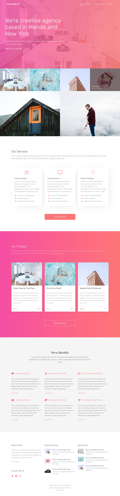

# CodinCamp #3

## Challenge 8

### Instructions

* Vous *pouvez* utiliser Bootstrap mais sans les .col (on utilise display: grid)
* SASS (mais sans commiter .sass-cache)
* Font utilisée: Rubik (dispo sur Google Fonts)
* Ex de :hover sur les photos: Pink Lips
* Etant votre dernier Challenge front, soignez le! (code HTML/CSS valide, bien indenté, avec des commits parlant qui vont permettre de comprendre les étapes de votre intégration)

